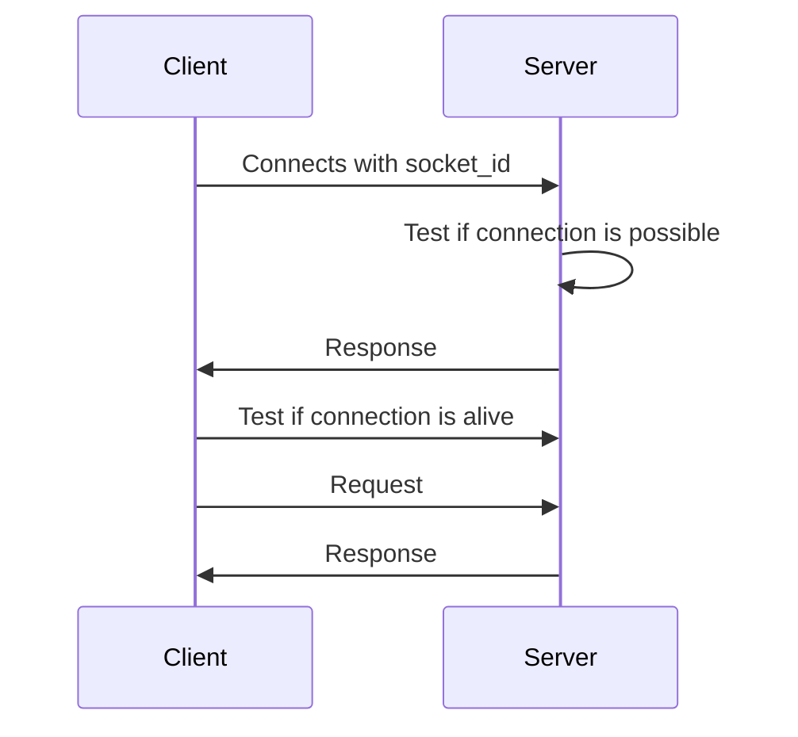

# lotti-karotti

Virtualizing the popular Table Top Game "Lotti Karotti" into an Android Application.

  
  

[](https://sonarcloud.io/summary/new_code?id=SE2-Gruppe3_lotti-karotti)

[](https://sonarcloud.io/summary/new_code?id=SE2-Gruppe3_lotti-karotti)

[](https://sonarcloud.io/summary/new_code?id=SE2-Gruppe3_lotti-karotti)

  
  

# Server

  

The server is based on NodeJS, any version >= 17.0.0 should do the trick.

  

## How to run

  

You need to have a current version of [Node](https://nodejs.org/en/download) running on your PC.

  

Then run the following command inside of the server folder:

  

```bash

npm install

node index.js

```

Please be advised that ``npm init`` only needs to be applied at the first start, otherwise it is used ambigiously.

### How to run it like you know what you are doing
If you are hosting a server, it is advisable to manage it using a server management tool such as PM2 or other similar modules. With such tools in place, the server is configured to automatically restart in case of any interruption or failure, and log the cause of such interruptions or failures, instead of simply crashing.

 Example
```bash

npm install pm2 -g 

pm2 start index.js

pm2 monit

```
Please be advised that ``npm install pm2 -g`` will install pm2 globally(on your machine)!
## Server Diagram


